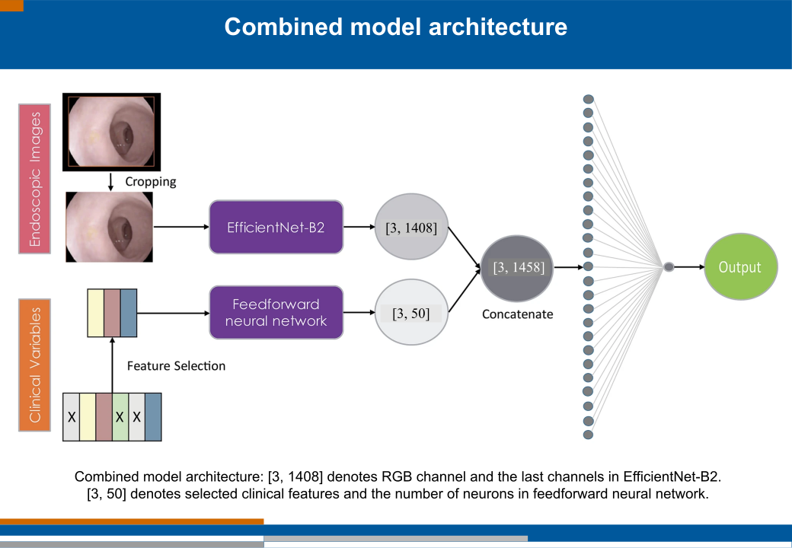

##  Endoscopic images and clinical variables to predict the response to radiation therapy
 
### Background and Aim

- Accurate response evaluation is crucial to select complete responders from rectal cancer patients diagnosed and treated with radiotherapy.

- The aim of this study was to evaluate the accuracy of response prediction with deep learning methods based on endoscopic images and clinical features.

- Present study shows clinical features are combined with endoscopic imaging features to improve the performance of the deep learning models and provide more confident clinical decisions.

- Details could be found in the below link (note that the codes and results provided in this repo are slightly modified): 
- [The use of deep learning on endoscopic images to assess the response of rectal cancer after chemoradiation](https://link.springer.com/article/10.1007/s00464-021-08685-7)
----
### Dataset
* 722 endoscopic images with clinical variables having 6 features 
* Roughly out of 722 records half of them are complete responses and half of them are non-complete responses.

### During endoscopic images and combined model training
* Basic augmentation techniques (rotation, flipping, shearing, and zooming of the original images) are applied.
* Since endoscopic images are RGB natural images, transfer learning from ImageNet was also applied.
----
### Code
* [Clinical variables model for response prediction (Clinical features model)](endoscopy_clinical_features_for_response_prediction.ipynb)
* [Endoscopic images and clinical features model for response prediction (Combined model)](endoscopy_image_and_clinical_features_for_response_prediction.ipynb)
----
### Proposed Combined Model Architecture

----
----
                    

## Results

| Dataset | Model | AUC | 
| ------------- | -------------| -------------| 
| Clinical variables  (with all 6 features) | FFN | 73%| 
| Selected clinical variables (with selected top 3 features) | FFN | 76%| 
| Endoscopic image  (trained in endoscopic images only) | EfficientNet-B2 | 79%| 
| Combined model (endoscopic image and selected clinical features) | EfficientNet-B2 and FFN | 83%| 

----
**Reference**
* [The use of deep learning on endoscopic images to assess the response of rectal cancer after chemoradiation](https://link.springer.com/article/10.1007/s00464-021-08685-7)
* [Melanoma. Pytorch starter. EfficientNet](https://www.kaggle.com/nroman/melanoma-pytorch-starter-efficientnet/output)
* [EfficientNet](https://github.com/qubvel/efficientnet)

