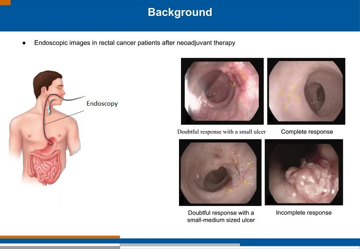

##  Endoscopic images and clinical variables to predict the response of radiation therapy
 
### Background and Aim

- Accurate response evaluation is necessary to select complete responders from rectal cancer patients diagnosed and treated with radiotherapy.

- The aim is to evaluate the accuracy of response prediction with deep learning methods based on endoscopic images and clinical features.

----
### Dataset
* 722 endoscopic images with clinical variables having 6 features (roughly out of 722 records half of them are complete response and half of them are non-complete response).

### During endoscopic images and combined model training
* Basic augmentation techniques (rotation, flipping, shearing and zooming of the original images) are used.
* Since endoscopic images are RGB natural images, transfer learning from the ImageNet was also used.
----
### Code
* [Clinical variables model for response prediction (Clinical features model)](endoscopy_clinical_features_for_response_prediction.ipynb)
* [Endoscopic images and clinical features model for response prediction (Combined model)](endoscopy_image_and_clinical_features_for_response_prediction.ipynb)
----
### Proposed Combined Model Architecture

----
----
                    

## Results

| Dataset | Model | AUC | 
| ------------- | -------------| -------------| 
| Cinical variables  (with all 6 features) | FFN | 74%| 
| Selected cinical variables (with selected 3 features) | FFN | 76%| 
| Endoscopic image  (trained in endoscpic images only) | EfficientNet-B2 | 79%| 
| Combined model (endoscopic image and selected clinical features) | EfficientNet-B2 | 84%| 

----
**Reference**
* [Melanoma. Pytorch starter. EfficientNet](https://www.kaggle.com/nroman/melanoma-pytorch-starter-efficientnet/output)
* [EfficientNet] (https://github.com/qubvel/efficientnet)
